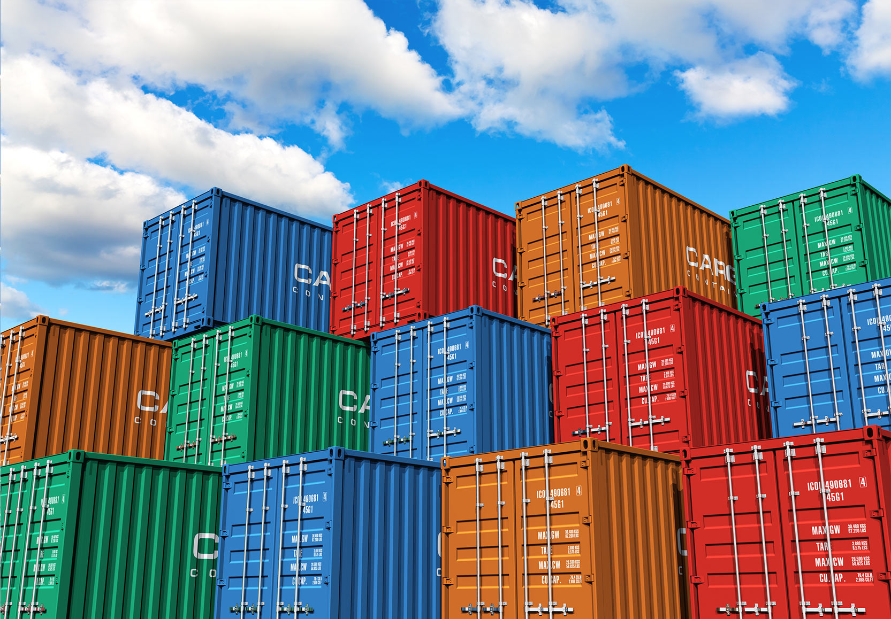

This is the second day post. Today we did pixi and containers. I will try to describe the containers.

No no, not these containers!

Containers are something temporary. You can use one container-image (think of it as a flat object) and send it to a colleague. Container-images can be found and pulled from a trusted platforms (like dockerhub or seqera) or built from scratch. The colleague or whoever has access to the container-image can then run or execute it to build a container(think of it as a 3D object, that you can actually open the door of the container and enter inside). Once you enter the container, you can do things that were not possible outside of the container (for example, the container can use linux, while your operating system is Windows). If you decide to run the container (apptainer run), then the script is ran first. If you execute the container (apptainer exec), then you skip the script. We can also run/execute containers via sbatch. 

if we want to create a new container, then we need a definition file (.def). Then we can use "apptainer build" to create an image from the definition file. When the imgage is created, we can run/execute to run the container(open the door and enter).

When we're done with the container, we can "exit". The container is gone now, so everything that was happening in there is gone too. But we can always rerun the image and create a new container. 

I think it's correct lol 