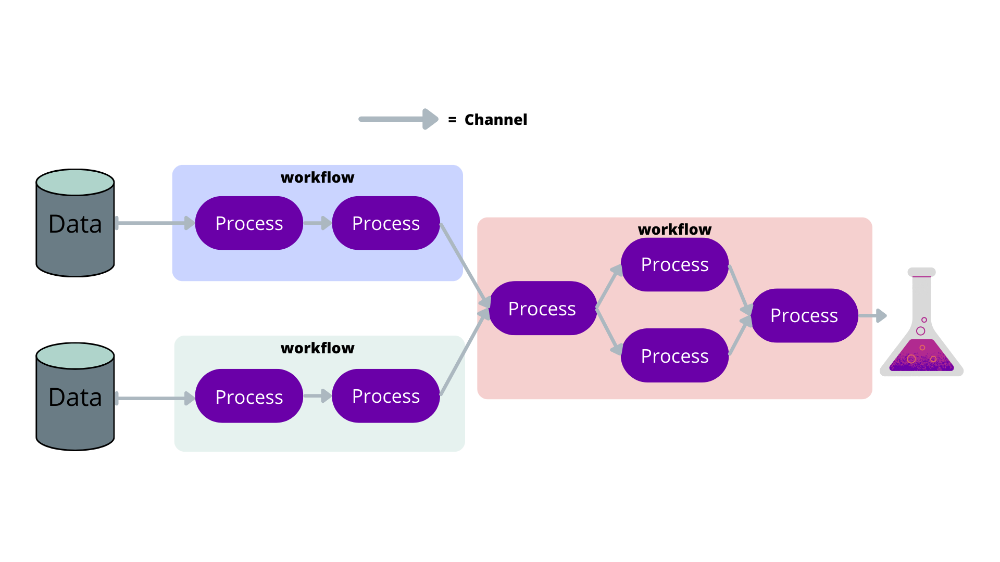

This is the third day post. Today we did nextflow and I will try to describe it.

Something like that!

Nextflow is a tool for creating and running workflows. A workflow is made up of different steps, called processes, that work together to analyse data. To pass the data, nextflow uses channels between these processes. The channels are like streams or queues that carry data from one process to another. For example, one process can create a file and send it through a channel to the next process, which then uses that file as input. Channels make it easier to connect the different steps of a workflow and process multiple files at the same time. 

PROCESSES can be written in capitals for easier identification. Each process has a name, input and output channels, and a script that defines what the process does. The script can be written in any programming language, like bash, python, or R. 

Again, we use screen -r to have a screen session, so we can detach from it and it can still run in the background. But if we exit the screen, then everything is gone. 

If we change something in the script, we can use -resume when we run the nextflow command, so it will only run the processes that have changed or their dependencies, so this can save a lot of time. 

I think that's all for today!
