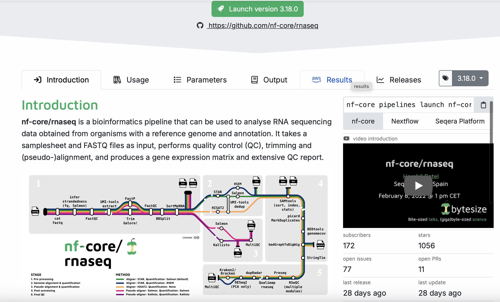

This is the fourth day post. Today we used nf-core and rna_seq.

I stole that screenshot from the course site hihi.

Okay so listen.

nf-core is a website where smart people have created and uploaded pipelines for whatever project you want to do. For example, if you want to do RNA-seq, you can find a pipeline for that on nf-core.
We used nextflow to run the pipeline. First we had to link the data files to our own folder/directory and work from there. To do that we used pixi (nextflow needs pixi) so the command was something like that: 
pixi run nextflow run nf-core/sarek -profile test --outdir sarek_test -c hpc2n.config

Then we had to do it all over on our own. We linked the data files using: 
ln -s SOURCE TARGET

Then on the nf-core/rnaseq homepage, we used the launcher to build the json file we used later. The json file is a configuration file that tells the pipeline what to do and where to find the data. To build it we had to give the input and output absolute paths. Later we were asked for the --fasta and --gtf files (absolute paths again), which are reference files for the genome and gene annotations. We downloaded them using wget to a directory for databases. We get the json file by clicking the "launch" button. 

Finally we had to run the pipeline using pixi and nextflow, like that:
pixi run nextflow run nf-core/rnaseq -r 3.26.0 -params-file nf-params.json -c hpc2n.config

Sidenote: Both config and json files have parameters. Config is for the server and json is for the pipeline.

Last step: BE PATIENT

PS: remember to use a screen session so you can detach and let it run in the background. You enter a screen with screen -s, and detach with ctrl+a+d. To reattach, use screen -r. If you exit the screen, everything is gone.
