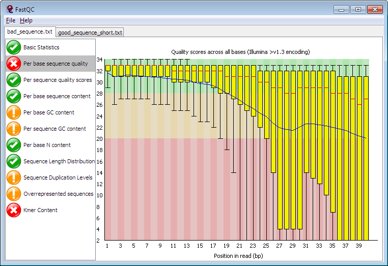

This is the fifth day post. Today I didn't join the course, but I'm making another post about a previous lecture.
When looking at the material, I realised that I haven't written anything about fastqc yet, so here it comes. 

This is one of the graphs produced after using fastqc. Fastqc is basically a quality control tool for high throughput sequence data. It provides a modular set of analyses which you can use to give a quick impression of whether your data has any problems of which you should be aware before doing any further analysis. 
On the left side of the picture you can see the different modules that fastqc uses to assess the quality of the data and if the quality is good or not. 

In order to use fastqc, you need to have it installed in the first place. It's advisable to use the screens once again to make sure your session will not be interrupted (it runs in the background). After installation, we used a pixi environment and we included the packages of conda-forge and bioconda. Then we used the command `fastqc` to run the program.

We also talked about SLURM, which is a job scheduler for Linux clusters. It allows users to submit jobs to a queue and manage resources efficiently and looks something like this: srun -A project_ID -t 15:00 -n 1 pixi run fastqc --noextract -o fastqc data/sampleA_1.fastq.gz data/sampleA_2.fastq.gz
You have to specify the project ID, the time limit, the number of nodes, and the command to run fastqc. The `--noextract` option tells fastqc not to extract the results, and the `-o` option specifies the output directory for the results. Finally, you provide the input files (in this case, two FASTQ files, like forward and reverse).
This basically tells the system how much time and resources to use for the job, and what command to run. Once the job is submitted, SLURM will manage the execution of the job and provide you with the results once it's completed.

And finally, sbatch is a command used to submit a job script to the SLURM job scheduler. A job script is a text file that contains the commands and parameters needed to run a specific job. The `sbatch` command takes the job script as input and submits it to the SLURM scheduler for execution. This way we can run a lot of samples at the same time, without having to run them one by one (for example if we tell sbatch to run anything ending in ".fastq.gz").

Thank you for the amazing course!
Hejdå!